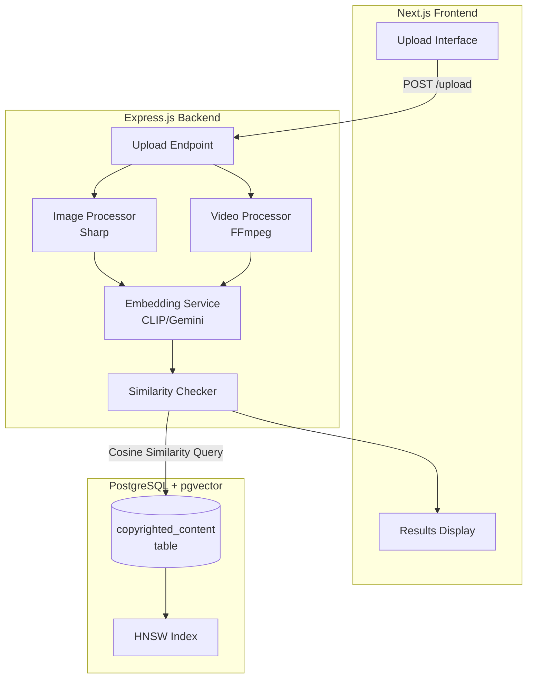

# Design Document

## Overview

The Copyright Detector is a full-stack application that uses AI-powered image similarity detection to identify potential copyright infringement. The system processes uploaded images (including AVIF) and videos (MP4), generates vector embeddings using CLIP or Gemini models, and compares them against a pgvector database of known copyrighted content using cosine similarity.

The architecture follows a three-tier pattern: a Next.js frontend for user interaction, an Express.js backend for media processing and API endpoints, and PostgreSQL with pgvector for vector storage and similarity search.

## Architecture



## Components and Interfaces

### 1. Image Processor (Sharp)

**Purpose:** Process uploaded images, convert formats, and normalize dimensions.

```typescript
interface ImageProcessor {
  processImage(inputBuffer: Buffer, mimeType: string): Promise<Buffer>;
}

// Input: Raw image buffer (AVIF, JPEG, PNG, WebP)
// Output: Normalized JPEG buffer (max 512x512)
```

**Implementation Details:**
- Uses Sharp library (v0.32+) for native AVIF support
- Resizes to fit within 512x512 while maintaining aspect ratio
- Outputs JPEG at 90% quality for consistent embedding generation

### 2. Video Processor (FFmpeg)

**Purpose:** Extract key frames from video files for analysis.

```typescript
interface VideoProcessor {
  extractKeyFrames(videoBuffer: Buffer): Promise<Buffer[]>;
}

// Input: MP4 video buffer
// Output: Array of 5 JPEG frame buffers
```

**Implementation Details:**
- Uses fluent-ffmpeg wrapper
- Extracts frames at 10%, 30%, 50%, 70%, 90% timestamps
- Resizes frames to 512px width maintaining aspect ratio
- Temporary file handling for FFmpeg processing

### 3. Embedding Service

**Purpose:** Generate vector embeddings from processed images.

```typescript
interface EmbeddingService {
  generateEmbedding(imageBuffer: Buffer): Promise<number[]>;
}

// Input: Processed JPEG buffer
// Output: Vector array (768 dimensions for Gemini, 512 for CLIP)
```

**Implementation Options:**
- **Primary:** Hugging Face Inference API with CLIP (openai/clip-vit-base-patch32)
- **Alternative:** Google Gemini embedding-001 model
- Both options have generous free tiers suitable for demo purposes

### 4. Similarity Checker

**Purpose:** Query pgvector database for similar content.

```typescript
interface SimilarityMatch {
  id: number;
  filename: string;
  similarity: number;
}

interface SimilarityChecker {
  findSimilarContent(embedding: number[], threshold?: number): Promise<SimilarityMatch[]>;
}

// Input: Query embedding vector, optional threshold (default 0.85)
// Output: Top 3 matches above threshold, ordered by similarity descending
```

**Implementation Details:**
- Uses pgvector's `<=>` operator for cosine distance
- Converts distance to similarity: `1 - distance`
- HNSW index for approximate nearest neighbor search

### 5. Upload API Endpoint

**Purpose:** Handle file uploads and orchestrate processing pipeline.

```typescript
interface UploadResponse {
  status: 'flagged' | 'safe';
  matches: Array<{
    filename: string;
    similarity: string; // e.g., "87.5%"
  }>;
  processingTime: number; // seconds
}

// POST /upload
// Content-Type: multipart/form-data
// Body: file (image or video)
```

### 6. Database Layer

**Purpose:** Manage PostgreSQL connection and pgvector operations.

```typescript
interface DatabaseService {
  initDatabase(): Promise<void>;
  insertCopyrightedContent(filename: string, embedding: number[], contentType: string): Promise<void>;
  findSimilarContent(embedding: number[], threshold: number): Promise<SimilarityMatch[]>;
}
```

## Data Models

### Copyrighted Content Table

```sql
CREATE TABLE copyrighted_content (
  id SERIAL PRIMARY KEY,
  filename TEXT NOT NULL,
  embedding VECTOR(768) NOT NULL,  -- Adjust based on embedding model
  content_type TEXT NOT NULL,       -- 'image' or 'video_frame'
  created_at TIMESTAMP DEFAULT NOW()
);

CREATE INDEX embedding_idx ON copyrighted_content 
USING hnsw (embedding vector_cosine_ops);
```

### API Request/Response Models

```typescript
// Upload Request
interface UploadRequest {
  file: File; // multipart form data
}

// Upload Response
interface UploadResponse {
  status: 'flagged' | 'safe';
  matches: SimilarityMatch[];
  processingTime: number;
}

// Error Response
interface ErrorResponse {
  error: string;
  details?: string;
}
```


## Correctness Properties

*A property is a characteristic or behavior that should hold true across all valid executions of a system-essentially, a formal statement about what the system should do. Properties serve as the bridge between human-readable specifications and machine-verifiable correctness guarantees.*

### Property 1: Supported format acceptance

*For any* file with mime type in {image/jpeg, image/png, image/webp, image/avif}, the image processor should accept the file without error, and *for any* file with mime type not in this set, the processor should reject with an error.

**Validates: Requirements 1.1, 1.4**

### Property 2: AVIF to JPEG conversion

*For any* valid AVIF image buffer, processing it through the image processor should produce a valid JPEG buffer.

**Validates: Requirements 1.2**

### Property 3: Image dimension constraint

*For any* input image with dimensions (w, h), the processed output dimensions (w', h') should satisfy: w' <= 512 AND h' <= 512 AND (w'/h' ≈ w/h within rounding tolerance).

**Validates: Requirements 1.3**

### Property 4: Video frame extraction count

*For any* valid MP4 video, extracting key frames should produce exactly 5 frame buffers.

**Validates: Requirements 2.1**

### Property 5: Video frame dimension constraint

*For any* extracted video frame, the frame width should equal 512 pixels.

**Validates: Requirements 2.2**

### Property 6: Frame-to-embedding consistency

*For any* set of extracted video frames, the number of generated embeddings should equal the number of frames.

**Validates: Requirements 2.3**

### Property 7: Embedding dimension validity

*For any* processed image, the generated embedding should be a non-empty array with the expected dimension count (768 for Gemini, 512 for CLIP).

**Validates: Requirements 3.1**

### Property 8: Similarity threshold filtering

*For any* set of similarity results returned by findSimilarContent, all results should have similarity > threshold (default 0.85).

**Validates: Requirements 3.3**

### Property 9: Result ordering and limit

*For any* query returning multiple matches, the results should be ordered by similarity descending and limited to at most 3 items.

**Validates: Requirements 3.4**

### Property 10: Embedding serialization round-trip

*For any* valid embedding vector, serializing to JSON and deserializing back should produce an equivalent vector (element-wise equality within floating point tolerance).

**Validates: Requirements 3.5, 3.6**

### Property 11: Flagged status classification

*For any* set of similarity matches where the maximum similarity > 0.85, the returned status should be "flagged".

**Validates: Requirements 4.1**

### Property 12: Safe status classification

*For any* set of similarity matches where all similarities <= 0.85 (or empty), the returned status should be "safe".

**Validates: Requirements 4.2**

### Property 13: Response structure validity

*For any* upload response, it should contain a numeric processingTime > 0, and each match should contain a non-empty filename string and a similarity string in percentage format.

**Validates: Requirements 4.3, 4.4**

## Error Handling

### Image Processing Errors

| Error Condition | Response |
|----------------|----------|
| Unsupported format | 400 Bad Request with accepted formats list |
| Corrupted image data | 400 Bad Request with "Invalid image data" message |
| Processing timeout | 500 Internal Server Error with timeout details |

### Video Processing Errors

| Error Condition | Response |
|----------------|----------|
| Invalid video format | 400 Bad Request with "Unsupported video format" |
| FFmpeg extraction failure | 500 Internal Server Error with FFmpeg error details |
| Empty video file | 400 Bad Request with "Video file is empty" |

### Embedding Service Errors

| Error Condition | Response |
|----------------|----------|
| API rate limit exceeded | 429 Too Many Requests with retry-after |
| API authentication failure | 500 Internal Server Error (logged, generic message to user) |
| Embedding generation timeout | 500 Internal Server Error with timeout details |

### Database Errors

| Error Condition | Response |
|----------------|----------|
| Connection failure | 500 Internal Server Error with "Database unavailable" |
| Query timeout | 500 Internal Server Error with timeout details |
| Vector dimension mismatch | 500 Internal Server Error (logged, indicates configuration issue) |

## Testing Strategy

### Property-Based Testing Framework

**Selected Library:** fast-check (JavaScript/TypeScript)

fast-check is chosen for its:
- Native TypeScript support
- Rich set of built-in arbitraries
- Shrinking capabilities for finding minimal failing cases
- Integration with Jest/Vitest

**Configuration:**
- Minimum 100 iterations per property test
- Seed logging for reproducibility
- Verbose mode for debugging failures

### Property-Based Tests

Each correctness property will be implemented as a property-based test with the following annotation format:

```typescript
// **Feature: copyright-detector, Property {N}: {property_text}**
```

Property tests will focus on:
1. Format validation and conversion (Properties 1-3)
2. Video frame extraction invariants (Properties 4-6)
3. Embedding generation and serialization (Properties 7, 10)
4. Similarity search result constraints (Properties 8-9)
5. Status classification logic (Properties 11-12)
6. Response structure validation (Property 13)

### Unit Tests

Unit tests complement property tests by covering:
- Specific edge cases (empty files, minimum/maximum dimensions)
- Integration points (API endpoint behavior)
- Error condition handling
- Mock-based tests for external API calls

### Test Organization

```
server/
├── services/
│   ├── imageProcessor.test.ts      # Properties 1-3
│   ├── videoProcessor.test.ts      # Properties 4-6
│   ├── embeddingService.test.ts    # Properties 7, 10
│   └── similarityChecker.test.ts   # Properties 8-9, 11-12
├── routes/
│   └── upload.test.ts              # Property 13, integration tests
└── test-utils/
    └── generators.ts               # Custom fast-check arbitraries
```

### Test Data Generation

Custom arbitraries for property tests:
- `arbImageBuffer`: Generates valid image buffers of various formats
- `arbVideoDuration`: Generates video duration values for frame extraction
- `arbEmbeddingVector`: Generates valid embedding vectors of correct dimensions
- `arbSimilarityScore`: Generates similarity scores in [0, 1] range
- `arbSimilarityMatch`: Generates match objects with filename and similarity
